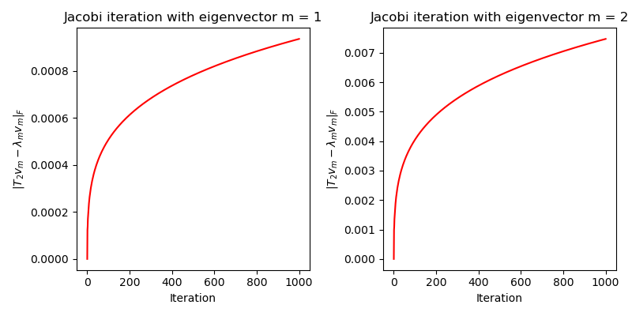

# APC523PS2
## Introduction
- Github repository for assignment 2 in APC523 is here: <a href = "https://github.com/ZINZINBIN/APC523PS2">https://github.com/ZINZINBIN/APC523PS2</a>
- Problem 3 is noted by both handwriting and code. The handwriting file is uploaded as "HW_02_prob_3_abc.pdf", and it contains 3-(a), 3-(b), and 3-(c).

<script type="text/javascript" src="http://cdn.mathjax.org/mathjax/latest/MathJax.js?config=TeX-AMS-MML_HTMLorMML"></script>
<script type="text/x-mathjax-config">
  MathJax.Hub.Config({ tex2jax: {inlineMath: [['$', '$']]}, messageStyle: "none" });
</script>

## Problem 1. Polynomial Interpolation
### Problem 1.1
The chebyshev node points are generated for each function from (a) to (c) with different p mentioned in problem 1. The code is written at main.py in p1 folder. The interpolation error computed by L2 and max error is given as table below.

|  $f(x)$       |      p        | L2 error      | Max error     |
| ------------- | ------------- | ------------- | ------------- |
|$1/(1+25 x^2)$ |     10        |     0.057     |     0.109     |
|abs($x$)       |     10        |     0.024     |     0.055     |
|$H(x-0.25)$    |     10        |     0.193     |     0.906     |
|$1/(1+25 x^2)$ |     20        |     0.008     |     0.015     |
|abs($x$)       |     20        |     0.009     |     0.028     |
|$H(x-0.25)$    |     20        |     0.103     |     0.708     |
|$1/(1+25 x^2)$ |     40        |     0.000     |     0.000     |
|abs($x$)       |     40        |     0.003     |     0.015     |
|$H(x-0.25)$    |     40        |     0.075     |     0.713     |

The interpolation of each function is plotted in below figure. Function (a) and (b) show that the approximation is being closer as p increases. Expecially, the Runge's pheonmenon can be covered as p is higher. However, in case of function (c), there is a discontinuity at $x=0.25$ and interpolation error seems to be still high at this point.

<div>
    <p float = 'left'>
        
    </p>
</div>

### Problem 1.2
For each function, the L2 error and max error are computed with different p and the result is represented in below figure. Note that the linear fitting for approximating the power law dependency of the error with respect to the interpolation degree p is applied for each function. Since the L2 error between given $f(x)$ and approximation $g(x)$ with equadistance points is proportional to $\frac{1}{(n+1)!}f^{(n+1)}(x)(x-x_0)...(x-x_n)$, we can expect that the L2 error and max error with Chebyshev node points also follow the similar relation. However, it is not exactly proportional to $\frac{1}{p+1}$ since the Chebyshev node points are not the equadistance points. Below figure shows the log-log scale of the errors with respect to interpolation degree $p$. For each function, the linear coefficients obtained from linear fitting indicates the power degree of $p$ corressponding to L2 and max error.

<div>
    <p float = 'left'>
        
    </p>
</div>

Function (b) shows that the error is almost proportional to $p^{-1}$, whereas function (a) and function (c) do not show the same tendency. In case of function (c), we can guess that the discontinuity at $x = 0.25$ results in Runge's phenomenon at that position and different tendency. 

### Problem 1.Bonus
For computing higher p, the code for computing the polynomials based on Chebyshev node points is modified. Using the property of Chebyshev polynomial, the Lagrange polynomial with Chebyshev node points can be replaced as Chebyshev polynomial. The modified code is as below. 

```
    def generate_pth_cheb_polynomial(x:np.array, p:int):
    
    T = np.ones((p + 1, len(x)))
    
    if p==0:
        return T
    
    T[1] = x

    for n in range(1,p):
        T[n+1] = 2 * x * T[n] - T[n-1]

    return T

    def generate_cheb_polynomial(x:np.array, y:np.array, p:int):

        T = generate_pth_cheb_polynomial(x,p)
        a = np.zeros(p+1)
        a[0] = np.mean(y)
        
        for i in range(1,p+1):
            a[i] = 2 / len(x) * np.sum(y * T[i])
        
        def interp(xn:np.array):
            Tn = generate_pth_cheb_polynomial(xn, p)
            r = np.sum(a.reshape(-1,1) * Tn, axis = 0, keepdims = False) 
            return r
        
        return interp
```

<div>
    <p float = 'left'>
        
    </p>
</div>

<div>
    <p float = 'left'>
        
    </p>
</div>

We can observe the similar results compared to Problem 1.2, while the power law dependency observed in above figure is slight different from the previous one.

## Problem 2. Integration
The 5-point Gaussian quadrature is applied for numerical integration. Similar to problem 1, linear fitting is again applied to see the power law dependency between the relative error and interval spacing $h$. It seems that the relative errors are approximately proportional to $h$ for all cases.

<div>
    <p float = 'left'>
        
    </p>
</div>

### Problem 2.Bonus
<div>
    <p float = 'left'>
        
    </p>
</div>

## Problem 3. Iterative Methods
Problem (a),(b),and (c) are represented in "HW_02_prob_3_abc.pdf". In case of problem (d), the error of the k-th iteration for $v_1$ and $v_2$ si given below.

<div>
    <p float = 'left'>
        
    </p>
</div>

We can use linear fitting for approximating the spectral radius from $log(\epsilon) / log(\rho) \sim n$. For m = 1, $\rho_1 \sim 0.99803$ and for m = 2, $\rho_2 \sim 0.9986$. While the previous problems derive that the spectral radius $rho=\frac{2}{\alpha}$, thus the convergence is not guaranteed when $\alpha = 2$. The numerical estimation shows that the spectral radius for $v_1$ and $v_2$ is close to 1 so that the error doesn't converge to zero. In more detail, we can observe the decrese of error due to the fact that the spectral radius obtained numerically is slightly less than 1, therefore there would be a decay of the value, but still it doesn't completely converge to zero. We can check this by computing $|T_2 v_m - \lambda v_m|_F$, which is given as below figure.

<div>
    <p float = 'left'>
        
    </p>
</div>

As the figure shows, the iteration doesn't converge to zero. For any arbitrary given vector $y = \sum_i y_i v_i$, we can expect that the convergence rate, or the spectral radius can be given as $\rho = \max_m \rho_m$, where $\rho_m$ is the spectral radius for $v_m$ following the above process. 