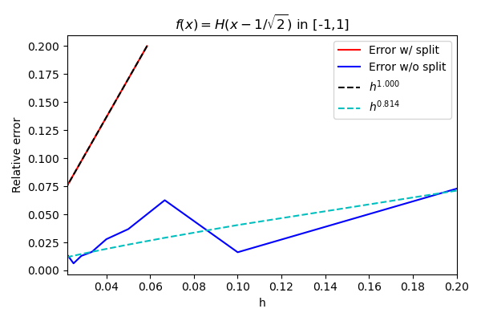

# APC523PS2
## Introduction
- Github repository for assignment 2 in APC523 is here: <a href = "https://github.com/ZINZINBIN/APC523PS2">https://github.com/ZINZINBIN/APC523PS2</a>
- Problem 3 is noted by both handwriting and code. The handwriting file is uploaded as "HW_02_prob_3_abc.pdf", and it contains 3-(a), 3-(b), and 3-(c).

## Problem 1. Polynomial Interpolation
Problem: Implement a method using Lagrange polynomial interpolation of degree pusing for the p+ 1 node points the roots of the degree p+ 1 Chebyshev polynomial. Write a function that takes as input f(x) on the interval [-1,1] and interpolates it to g(x). Compute the L2 error and the maximum error of your interpolation using a fine grid with N = 1000 points uniformly distributed in the domain.
1. Plot the actual function f(x) and its approximation g(x) as function of xon the fine grid. Do this for each function above using 3 different Lagrange polynomial degrees p= {10,20,40}. Mark the p+ 1 Chebyshev nodes on the plot of g(x).
2. Plot the L2 and maximum errors as a function of p∈[1,256] using a log-log scale. Label the observed power law dependencies using dashed lines. Interpret the results.      
3. (Bonus) Try and go up to p = 1024. You will need to take advantage of the property that the Lagrange polynomials based on Chebyshev nodes can be written using Chebyshev polynomials, which are easier and faster to compute.

### Problem 1.1

    

        
    

### Problem 1.2

    

        
    

### Problem 1.Bonus

    

        
    

    

        
    

## Problem 2. Integration
Problem: Write a numerical integration function that takes the following arguments: a function f(x), a number of discrete intervals N, and the integration bounds aand b. The function must return the value of integral f(x) from a to b. The integrator should use 5-point Gaussian Quadrature method in each of the N intervals. 

Plot the relative error of integration as a function of h= (b−a)/N for
(a) a=−1,b= 1,f(x) = x8
(b) a=−1,b= 1,f(x) = |x−1/√2|^3
(c) a=−1,b= 1,f(x) = H[x−1/√2]
(d) a= 0,b= 1,f(x) = 1/√x.

Determine the power law dependency of each error curve as a function of h(e.g. h^0.5, h^1, or h^2). Then, plot the corresponding power-law trend as a dashed line for reference. Write the explanations of the power law dependencies that you find for each function in the write-up.
        
(Optional) What do you think will happen if we split the integration domain for function (c) into [−1,1/√2] and [1/√2,1]? Can you explain the error scaling that you obtain by splitting the domain?

### Problem 2.1

    

        
    

### Problem 2.Bonus

    

        
    

### Problem 3. Iterative Methods

    

        
    

